# Лабораторная №3 — Аутентификация и авторизация (JWT)

## Цель работы
 - Освоить методы аутентификации и авторизации в backend-приложениях на Node.js.
 - Реализовать защиту REST API с помощью JWT (JSON Web Token).
 - Научиться разграничивать доступ к ресурсам в зависимости от роли пользователя.


## Условие
Модифицировать существующий сервис ToDo REST API, добавив систему пользователей и механизм JWT-аутентификации.

Сервис должен поддерживать:

   - регистрацию и вход пользователей;
   - получение JWT-токена при успешном входе;
   - использование токена для доступа к защищённым ресурсам (/api/todos, /api/categories);
   - разграничение прав пользователей (администратор может управлять всеми, обычный — только своими).


## Что было реализовано

- База данных (SQLite, better-sqlite3)
  - Таблица `users` (+ индексы на username/email, bcrypt‑хеш пароля).
  - В таблицу `todos` добавлен столбец `user_id` (FK → users.id), индексы на `user_id`, `category_id`, `completed`.
  - RBAC-модель: `roles`, `permissions`, `role_permissions`, `user_roles` (многие‑ко‑многим).
  - Сиды RBAC: роли `admin`, `user`; права `TODO_*`, `CATEGORY_*`. Роль `user` не имеет `TODO_DELETE` (получит 403 при DELETE).

- Аутентификация и авторизация
  - Эндпоинты `/api/auth/register`, `/api/auth/login`, `/api/auth/profile`.
  - JWT с payload: `{ userId, username, role }` и сроком жизни `1h` (настраивается).
  - Middleware: `authRequired`, `isOwnerOrAdmin`, `requirePermission(permissionCode)`.
  - Ролевые правила:
    - user: может работать только со своими задачами, без права удаления; create/update разрешены.
    - admin: полный доступ ко всем задачам; управление категориями (CRUD).

- Безопасность и документация
  - Поддержка `JWT_SECRET_KEY` из `.env`.
  - Swagger (`/api-docs`) с описанием эндпоинтов и security scheme Bearer.


## Архитектура и файлы

- `app.js` — точка входа, JSON‑парсер, маршруты, Swagger, инициализация схемы.
- `db/db.js` — обёртка вокруг better-sqlite3.
- `utils/create.js` — создание/миграция схемы БД (users, todos, categories, RBAC‑таблицы, индексы, сид RBAC).
- `model/*` — уровень данных: `user.js`, `todo.js`, `category.js`, `rbac.js`.
- `controller/*` — бизнес‑логика: `authController.js`, `todoController.js`, `categoryController.js`.
- `middleware/auth.js` — проверка JWT и прав.
- `router/*` — маршруты и привязка middleware.
- `script/migrate.js` — миграция/наполнение данных 


## Запуск

1) Установка зависимостей (Node.js 20+ или 22):

```
npm install
```

2) Миграция схемы БД:

```
npm run migrate
```

3) Запуск сервера:

```
npm run dev
```

API: http://localhost:3000/api  ·  Swagger UI: http://localhost:3000/api-docs

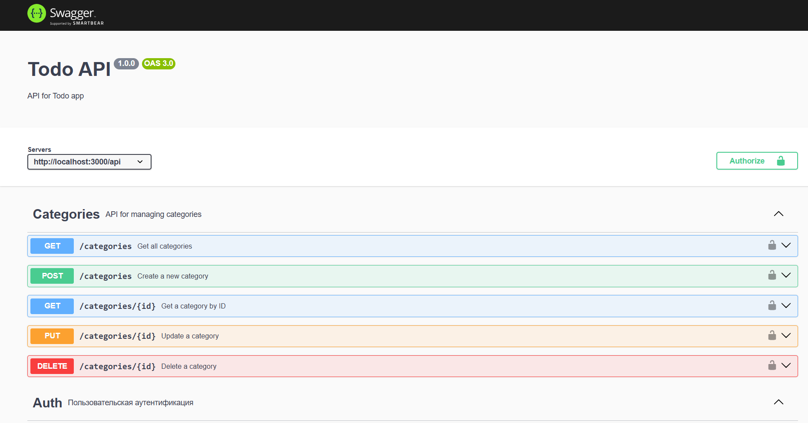


## Ход выполнения (шаги 1–4 и 6)


### Шаг 1. Структура базы данных

Созданы таблицы `users`, `categories`, `todos` и добавлена связь владельца задачи `todos.user_id → users.id` (+ индексы). Фрагменты:

```js
// utils/create.js
exec(`CREATE TABLE IF NOT EXISTS users (
  id INTEGER PRIMARY KEY AUTOINCREMENT,
  username VARCHAR(50) NOT NULL UNIQUE,
  email VARCHAR(100) NOT NULL UNIQUE,
  password TEXT NOT NULL,
  role VARCHAR(20) NOT NULL DEFAULT 'user' CHECK (role IN ('user','admin')),
  created_at TIMESTAMP DEFAULT CURRENT_TIMESTAMP,
  updated_at TIMESTAMP DEFAULT CURRENT_TIMESTAMP
)`);

// Добавление владельца задачи и индексы
const hasUserId = db.prepare("PRAGMA table_info(todos)").all().some(c => c.name === 'user_id');
if (!hasUserId) {
  exec(`ALTER TABLE todos ADD COLUMN user_id INTEGER REFERENCES users(id) ON DELETE CASCADE`);
}
exec(`CREATE INDEX IF NOT EXISTS idx_todos_user ON todos(user_id)`);
```

## Схема базы данных 
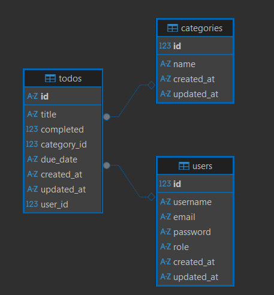

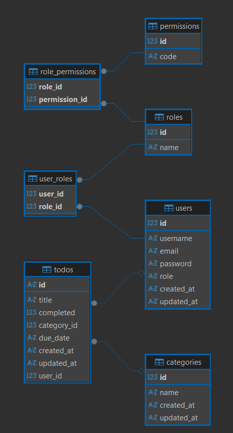


### Шаг 2. Аутентификация

Маршруты авторизации:

```js
// router/authRouter.js
router.post('/register', authController.register);
router.post('/login', authController.login);
router.get('/profile', authRequired, authController.profile);
```

#### Swagger UI (группа Auth)

В Swagger UI есть отдельная группа Auth с тремя эндпоинтами (register, login, profile). Для register/login токен не требуется, для profile — нужно нажать Authorize и ввести Bearer JWT.

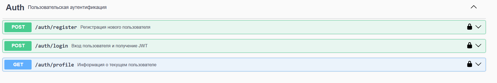

Примеры запросов (JSON):

- Регистрация (POST /api/auth/register)

```
{
  "username": "admin",
  "email": "admin@example.com",
  "password": "admin123",
  "role": "admin"
}
```

После регистрации запись появляется в таблице users, пароль хранится в виде bcrypt-хеша:

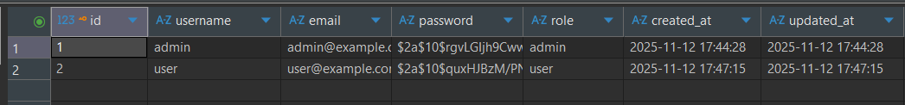

- Логин (POST /api/auth/login)

```
{
  "login": "admin",   // можно username или email
  "password": "admin123"
}
```

- Профиль (GET /api/auth/profile)
  - Заголовок: `Authorization: Bearer <JWT>`

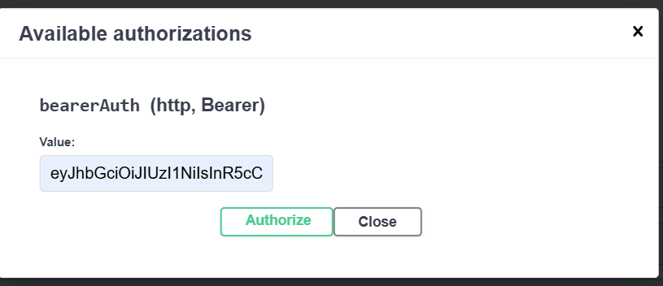

Вход и выпуск JWT:

```js
// controller/authController.js (фрагмент)
const JWT_SECRET = process.env.JWT_SECRET_KEY || process.env.JWT_SECRET || 'dev-secret';
const token = jwt.sign({ userId: userRow.id, username: userRow.username, role: userRow.role }, JWT_SECRET, { expiresIn: '1h' });
res.json({ token });
```

Проверка токена middleware:

```js
// middleware/auth.js (фрагмент)
const [type, token] = (req.headers.authorization || '').split(' ');
if (type !== 'Bearer' || !token) { throwUnauthorized(); }
const payload = jwt.verify(token, JWT_SECRET);
req.user = { userId: payload.userId, username: payload.username, role: payload.role };
```

Иллюстрации (регистрация и обработка конфликта):

- Тело запроса на регистрацию нового пользователя:


- Повторная регистрация с тем же username/email возвращает `409 Conflict` (уникальность):

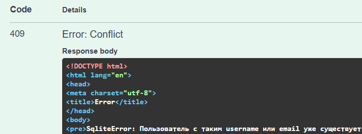


### Шаг 3. Авторизация (роли и владение)

Права на действия по маршрутам и проверка владельца:

```js
// router/todoRouter.js (фрагмент)
router.post('/', authRequired, requirePermission('TODO_CREATE'), todoController.createTodo);
router.put('/:id', authRequired, requirePermission('TODO_UPDATE'), isOwnerOrAdmin, todoController.updateTodo);
router.delete('/:id', authRequired, requirePermission('TODO_DELETE'), isOwnerOrAdmin, todoController.deleteTodo);
```

```js
// middleware/auth.js (фрагмент)
export async function isOwnerOrAdmin(req, res, next) {
  if (req.user?.role === 'admin') return next();
  const todo = todoModel.getTodoById(req.params.id);
  if (!todo) return next(notFound());
  if (todo.owner_id !== req.user?.userId) return next(forbidden());
  next();
}
```

### Шаг 4. (Доп) RBAC — роли и разрешения

Добавлены таблицы `roles`, `permissions`, `role_permissions`, `user_roles` и сиды: пользователю не выдаётся `TODO_DELETE`.

```js
// utils/create.js (фрагмент)
exec(`CREATE TABLE IF NOT EXISTS roles (id INTEGER PRIMARY KEY AUTOINCREMENT, name VARCHAR(50) UNIQUE)`);
exec(`CREATE TABLE IF NOT EXISTS permissions (id INTEGER PRIMARY KEY AUTOINCREMENT, code VARCHAR(100) UNIQUE)`);
exec(`CREATE TABLE IF NOT EXISTS role_permissions (role_id INTEGER, permission_id INTEGER, PRIMARY KEY (role_id, permission_id))`);
exec(`CREATE TABLE IF NOT EXISTS user_roles (user_id INTEGER, role_id INTEGER, PRIMARY KEY (user_id, role_id))`);
// role 'user' получает CREATE/READ/UPDATE без DELETE
```

Проверка разрешений в middleware:

```js
// middleware/auth.js (фрагмент)
export function requirePermission(code) {
  return (req, _res, next) => {
    if (req.user?.role === 'admin') return next();
    if (userHasPermission(req.user?.userId, code)) return next();
    next(forbidden());
  };
}
```

### Шаг 6. Проверка и демонстрация

1) Зарегистрируйте двух пользователей (admin/user). 
2) Выполните логин и вставьте JWT в Swagger (Authorize). 
3) Проверьте:
   - user → `POST /api/todos` — 201 OK;
  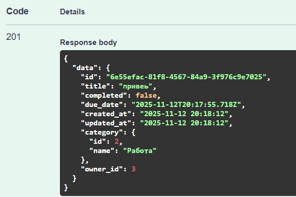

   - user → `DELETE /api/todos/:id` — 403 Forbidden;

  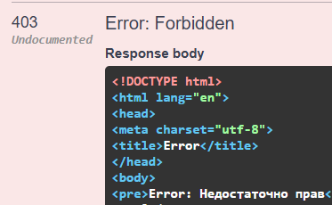
   - admin → `PUT/DELETE` задач/категорий — 200/204.

  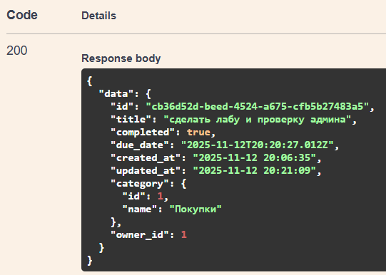
   
  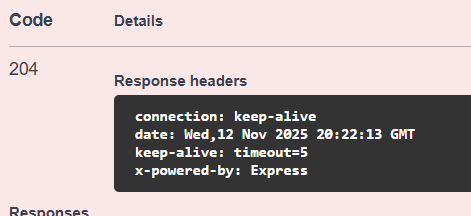


## Контрольные вопросы
1) Что такое JWT и как он работает?
это способ передавать информацию между клиентом и сервером в виде зашифрованного токена.
Когда пользователь входит в систему, сервер создаёт токен с данными (например, ID пользователя), подписывает его секретным ключом и отправляет клиенту. 
Клиент хранит этот токен (обычно в localStorage или cookie) и при каждом запросе отправляет его обратно. 
Сервер проверяет подпись токена- если всё совпадает, значит пользователь авторизован.

2) Как безопасно хранить пароли?
Пароли нельзя хранить в открытом виде. Обычно их хешируют с помощью специальных функций.
Хеш - это как отпечаток пароля, из которого нельзя восстановить оригинал. При входе в систему пароль снова хешируется и сравнивается с тем, что в базе. 
Так злоумышленник не узнает реальные пароли даже если получит доступ к базе.

3) Разница между аутентификацией и авторизацией?
  - Аутентификация - это проверка, кто ты (вход по логину и паролю)
  - Авторизация - это проверка, что тебе разрешено делать (например, только админ может удалять пользователей)
   
4) Плюсы и минусы Passport.js?
Преимущества:
  - Много готовых стратегий (напримкр Google, Facebook)
  - Упрощает работу с аутентификацией- меньше писать кода
  - Хорошо интегрируется с Express

Недостатки:
  - Иногда сложно разобраться с конфигурацией
  - Не всегда удобно настраивать под специфические задачи
  - Может быть избыточен для простых проектов

  ---

# Ошибки, валидация, логгирование и Sentry (Лаба 4)

  ## Централизованная обработка ошибок
  - Все пользовательские ошибки наследуются от `AppError` (`errors/AppError.js`).
  - Формат ответа при ошибке:
  ```json
  {
    "status": "error",
    "message": "Описание ошибки",
    "errors": [ { "field": "имя", "message": "описание" } ] // только для ValidationError
  }
  ```
  - Валидационные ошибки (`ValidationError`) возвращают код 400 и массив полей.
  - Неоперационные (непредвиденные) ошибки в production маскируются сообщением "Внутренняя ошибка сервера".

  ## Валидация (express-validator)
  - Файл `validators/userValidator.js` содержит цепочки `registerValidator`, `loginValidator` и middleware `handleValidation`.
  - Пример маршрута:
  ```js
  router.post('/register', registerValidator, handleValidation, authController.register);
  ```
  - При наличии ошибок формируется `ValidationError`.

  ## Логгирование (winston + daily rotate)
  - Файл `utils/logger.js` использует два транспорта с ротацией: `error-%DATE%.log`, `combined-%DATE%.log` (30 дней хранения, архивирование).
  - Middleware `requestLogger` добавляет `requestId` и логирует начало/завершение запросов, а также время ответа.
  - Ошибки логируются централизованно в `middleware/errorHandler.js` со стеком.


  ## Быстрая проверка
  1. Запустите сервер `npm run dev`.
  2. Отправьте некорректный запрос на `/api/auth/register` (например, короткий пароль) — получите 400 с массивом ошибок. 

 

 
  3. Вызовите несуществующий маршрут `/api/unknown` — получите 404.
  
  4. Вызовите логин с неверным паролем — 401 `AuthenticationError`.
  


  ## Структура, связанная с заданием
  - `errors/*` — классы ошибок (AppError, ValidationError, AuthenticationError, NotFoundError, UserNotFoundError).
  - `middleware/errorHandler.js` — централизованный ответ и отправка в Sentry.
  - `middleware/requestLogger.js` — логгирование запросов.
  - `validators/userValidator.js` — правила + обработка результатов.
  - `utils/logger.js` — конфигурация winston с ротацией.

  ## Расширение
  Для других сущностей (todos, categories) можно добавить аналогичные валидаторы и выбрасывать `ValidationError` при неверных данных.
   

### Контрольные вопросы
1) Какие преимущества централизованной обработки ошибок в Express?
Это удобнее: все ошибки обрабатываются в одном месте, не нужно копировать код в каждом контроллере.
Меньше багов: можно единообразно скрывать детали в production и показывать подробности в dev.
Легко логировать и отправлять ошибки в сторонние сервисы (Sentry) — одна точка интеграции.

2) Какие категории логов вы решили вести в системе и чем обусловлен ваш выбор?
Запросы: входящие запросы и время ответа — для мониторинга производительности и поиска медленных эндпоинтов.
Ошибки сервера (5xx): подробно (стек, payload) — чтобы фиксить баги.
Клиентские ошибки (4xx): предупреждения — для понимания неверных запросов/валидации.
Хранение в файлы с ротацией — чтобы не разрастался лог и можно было архивировать/анализировать по дням.

3) Какие существуют подходы к валидации данных в Express и какие из них вы использовали?
Подходы:
Библиотеки-валидаторы в middleware (например, express-validator) — декларативно описываешь правила рядом с маршрутом.
Схемные валидаторы (например, Joi) — проверка схемы объекта, часто используется в сервисах и валидаторах тела запроса.
Валидация на уровне модели/ORM (например, в Sequelize/Mongoose) — для дополнительных гарантий при сохранении.
Что использовано в проекте:
express-validator — правила описаны в validators/* (например, registerValidator, loginValidator), результат обрабатывается в handleValidation и при ошибках выбрасывается ValidationError, которую перехватывает глобальный errorHandler и возвращает { status: "error", message: "Ошибка валидации данных", errors: [...] } с кодом 400.

